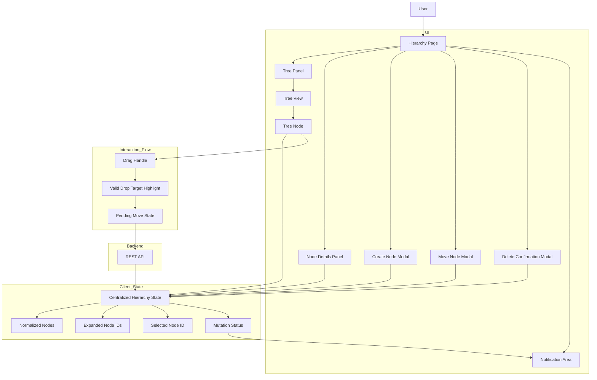
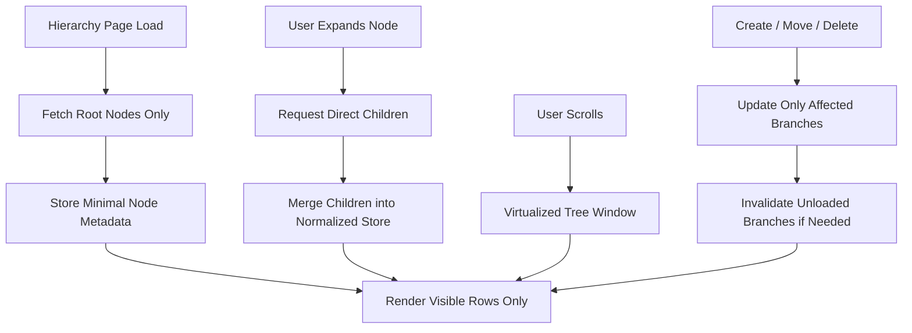
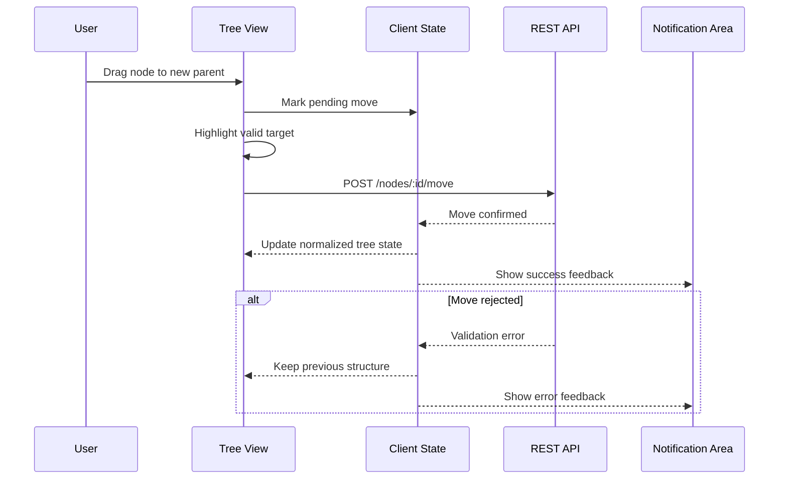
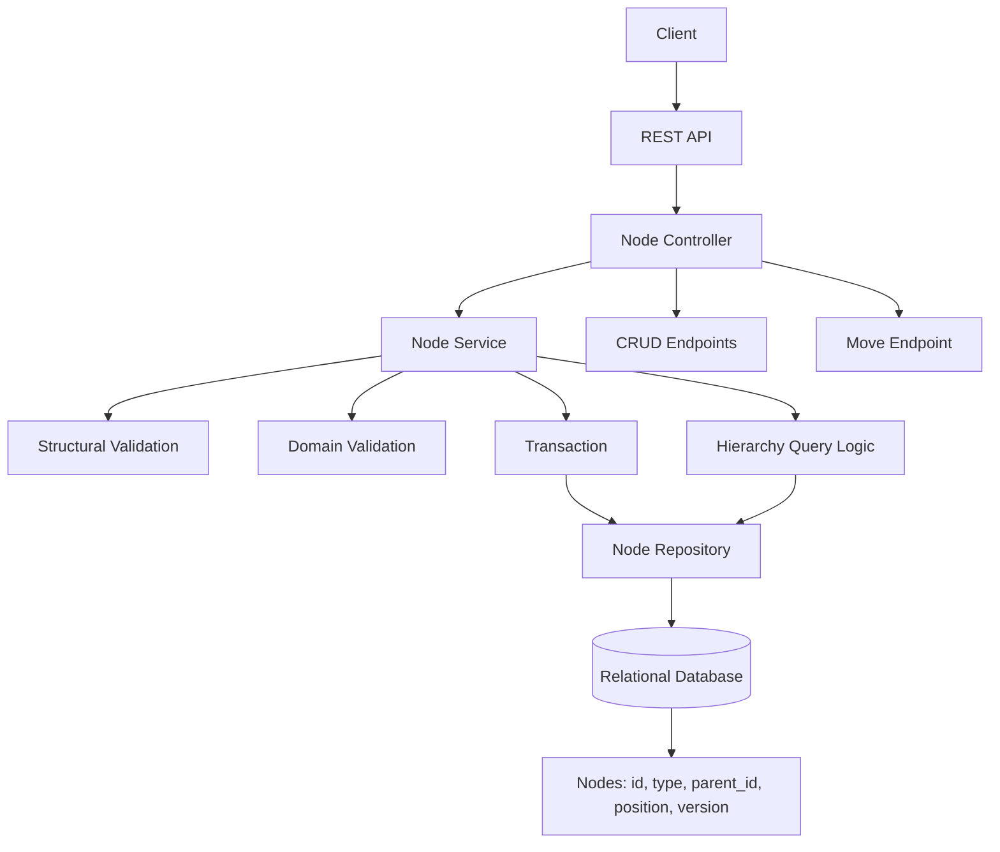
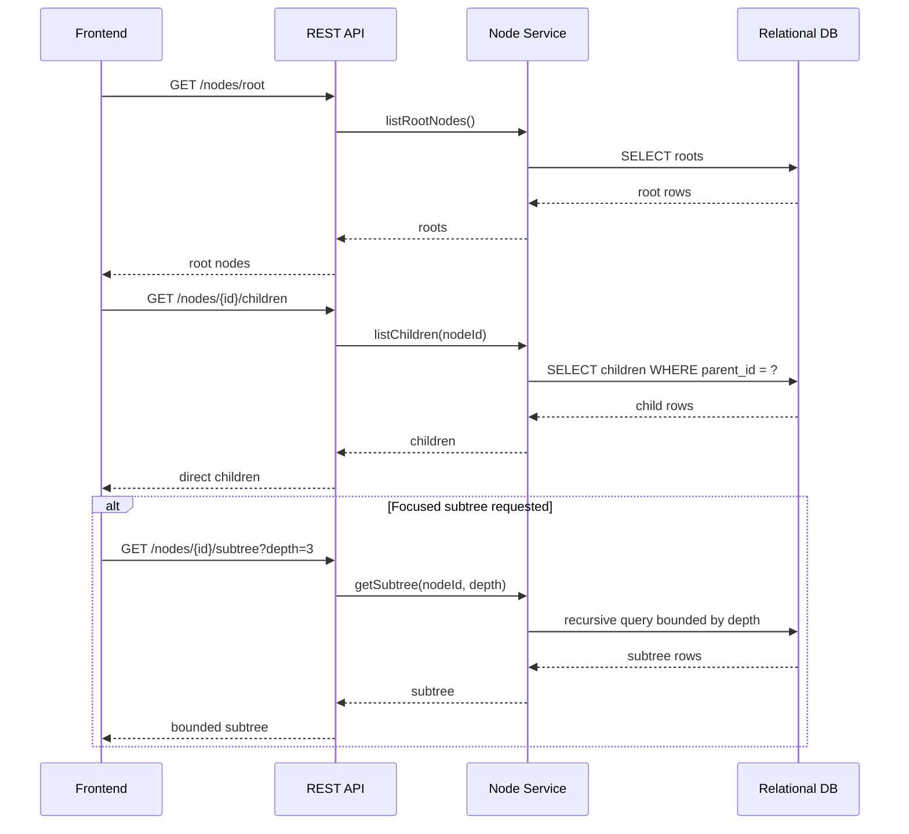
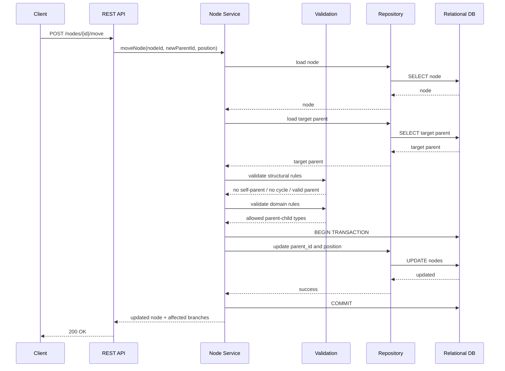
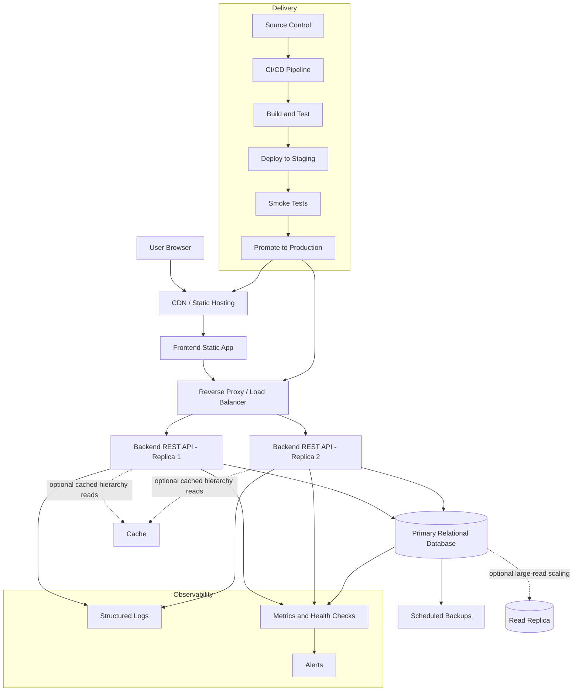

# Architecture Challenge

## Overview

Design the architecture for a **web application that manages the asset tree** you built in the coding challenge. The application should let users visualize the tree and perform CRUD operations on its nodes (Locations, Assets, and Components) — including creating, editing, relocating, and deleting nodes.

Document your architecture in this file using **text-based diagrams** (Mermaid, ASCII, or any text-renderable format — no images).

---

## Functional Requirements

1. **Tree visualization** — display the full hierarchy of Locations, Assets, and Components as an interactive tree.
2. **Create node** — add a new Location, Asset, or Component under a selected parent node.
3. **Edit node** — update the properties of an existing node (name, sensor type, status, etc.).
4. **Relocate node** — move a node (and its subtree) to a different parent via drag-and-drop or explicit action.
5. **Delete node** — remove a node and its entire subtree, with a confirmation step.

---

## What You Must Deliver

Design and document the following **three layers** in the sections below. Use **Mermaid diagrams** (preferred) or ASCII diagrams — no images.

### 1. Frontend Architecture

Consider:
- Framework/library choices and why
- Component structure (tree view, forms, modals, etc.)
- State management — how the tree state is kept in sync after mutations
- How drag-and-drop relocation works
- Optimistic updates vs. waiting for server confirmation

#### Hierarchy State and Node Relocation Flow

**Your explanation:**

1. Decision drivers

The frontend architecture is driven by the need to render and manipulate hierarchical data in a way that is clear, responsive, and consistent with backend-enforced rules. The most important UI operation is node relocation, since moving a node changes the structure itself and requires the frontend to communicate intent, prevent obvious invalid actions, and handle backend validation failures gracefully. The design must also support common hierarchy interactions such as expansion and collapse, node selection, subtree inspection, and CRUD actions without losing user context. Because structural mutations can affect multiple visible branches, the frontend needs a state model that can update the hierarchy predictably after create, delete, and move operations while preserving expansion and selection state. Additional drivers include rendering efficiency for larger trees, synchronization with backend validation rules such as allowed parent-child relationships, and overall maintainability for a small team.

2. Options considered

Several frontend approaches were considered across rendering, state management, and relocation interaction. A server-driven or page-oriented frontend would reduce client complexity, but it is poorly suited for a hierarchy editor because structural changes require preserving context, expansion state, and partial refresh of the tree. A client-side application with a structured component hierarchy is a better fit because it supports interactive browsing, focused node editing, and responsive updates after mutations. For state management, relying only on local component state is simple initially, but becomes fragile when move operations affect multiple branches and shared UI concerns such as selection, expansion, and mutation status. A centralized client-side state model with normalized node data offers better coordination and clearer mutation handling. For relocation, drag-and-drop provides the most natural interaction for manipulating a tree, but it should be paired with a form-based or action-based move flow so that the interface remains accessible and can support explicit validation when needed. Overall, the strongest candidate is a client-side tree editor with centralized hierarchy state and a relocation model that supports both drag-and-drop and explicit move actions.

3. Recommended approach

The frontend should be implemented as a React and TypeScript client application centered on a tree view, node detail forms, and dedicated modal flows for structural actions. React is a strong fit because the interface decomposes naturally into reusable components such as tree nodes, action menus, forms, and relocation dialogs, while TypeScript improves safety for node types, mutation payloads, and validation states. The hierarchy should be managed through a centralized client-side state model using normalized node data, with global ownership of the tree structure, selected node, expanded nodes, and mutation status, while local concerns such as modal visibility and temporary form values remain inside components.

The recommended component structure includes a hierarchy page, a tree panel, a tree view with reusable tree node components, a node details panel for editing, and separate modal components for create, move, and delete actions. This keeps browsing, editing, and structural mutations clearly separated. Drag-and-drop should be implemented as a guided relocation flow with explicit drag handles, visual highlighting of valid targets, and prevention of obviously invalid local moves such as dropping onto the same node or one of its descendants. The backend remains authoritative, so the frontend must handle rejected relocation requests gracefully.

For synchronization, the tree should be stored in normalized form rather than as a single nested object, allowing source and target branches to be updated predictably after mutations. The recommended strategy is to use limited optimistic behavior: non-structural edits may update immediately, but structural mutations such as relocation should wait for server confirmation before committing the visible tree change. During that time, the UI should show pending feedback on the affected node or branch.

For structural mutations, the frontend should avoid refreshing the entire hierarchy after each change. Instead, it should update only the affected branches. A create operation may append a child to the loaded parent branch if that parent is already expanded. A delete operation may remove the visible subtree from the store and decrement the parent’s child count. A relocation should update only the source branch, target branch, and moved subtree after server confirmation. If a branch involved in the mutation is not currently loaded, the frontend may invalidate that branch and reload it on next expansion rather than forcing a full-tree refresh.

#### Frontend strategy for very large hierarchies

When the hierarchy becomes very large, the frontend should treat the tree as a partially loaded graph rather than as a single document fetched in full. The client initially loads only root-level nodes and expands deeper levels on demand. Each loaded node includes enough metadata to render a row and indicate whether more children exist. The tree component computes a flattened list of currently visible rows from the loaded nodes plus expansion state, and virtualization ensures that only the rows within the viewport are mounted. This approach allows the interface to remain responsive even when the overall hierarchy size is far larger than what the browser could safely render at once.

#### Frontend Flow for Server-Confirmed Node Move

4. Tradeoffs

The recommended frontend architecture prioritizes predictable handling of hierarchy mutations, clear interaction boundaries, and maintainable state management, but it does so at the cost of higher client-side complexity. A React and TypeScript application with centralized normalized tree state provides a strong foundation for coordinating create, update, delete, and move operations, especially when a structural change affects multiple visible branches. It also allows the interface to separate navigation, node editing, and relocation into explicit components and flows, which improves clarity and testability. Drag-and-drop further improves usability by making structural changes direct and visible, while an explicit move dialog provides a safer and more accessible fallback.

The main tradeoff is that this design is more complex than a simpler page-oriented or fully local-state implementation. It requires careful state boundaries, mutation lifecycle handling, and controlled synchronization with backend responses. In addition, the recommendation to wait for server confirmation before committing structural moves favors correctness and simpler error handling over maximum immediacy in the interface. Drag-and-drop also adds implementation and accessibility complexity, which is why it should not be the only relocation mechanism.

These tradeoffs are acceptable because the interface must support a mutable hierarchy reliably, and the chosen architecture offers stronger long-term usability and control than a simpler but less structured frontend design.

---

### 2. Backend Architecture

Consider:
- API design (REST, GraphQL, etc.) and endpoint/operation structure for each CRUD action
- How relocating a node is handled (cycle prevention, subtree integrity)
- Database choice and how the tree is stored (adjacency list, nested sets, materialized path, etc.)
- Validation rules (e.g., a Component can only be a child of an Asset or Location)

#### Backend Architecture Overview

**Your explanation:**

1. Decision drivers

The backend must provide a reliable model for hierarchical data with emphasis on correctness during structural mutations. The central operation is moving a node or subtree within the tree, which introduces constraints around atomicity, cycle prevention, parent validation, and concurrent modification handling. The persistence and API design should support the main read patterns efficiently, especially subtree retrieval, ancestor reconstruction, and partial refresh after a move. Because the solution is expected to be maintainable by a small team, the architecture should prioritize clear domain semantics, testable invariants, and moderate operational complexity rather than overly specialized optimizations.

2. Options considered

Several hierarchy persistence models were considered. An adjacency list stores only the direct parent reference and offers the simplest write model, especially for create and move operations, but requires recursive traversal for subtree and ancestor queries. Materialized path stores the ancestry path on each node, which simplifies subtree and path queries, but makes subtree moves more expensive because descendant paths must be rewritten. Nested sets support efficient read-heavy hierarchical queries, but are poorly suited for frequent structural mutations due to costly index recalculation. Closure table stores ancestor-descendant relationships explicitly and provides flexible hierarchy queries, but increases schema complexity, write complexity, and operational overhead. Given that subtree relocation is a central domain operation and maintainability is an important constraint, the strongest candidates are adjacency list and materialized path, with nested sets and closure table being less attractive for an initial implementation.

3. Recommended approach

The backend should be implemented as a REST API backed by a relational database, with the hierarchy stored using an adjacency list model. Each node is persisted with a `parent_id` reference to its direct parent, which keeps the data model simple and well aligned with the domain. Standard CRUD actions should be exposed through regular endpoints for creating, retrieving, updating, and deleting nodes, while hierarchy-specific reads such as children, subtree, and ancestors should be exposed through dedicated read endpoints. Node relocation should not be treated as a generic update; instead, it should be modeled as an explicit operation such as `POST /nodes/{id}/move`, since relocating a node requires specialized validation and transactional handling.

For large hierarchies, the backend should separate structural writes from hierarchy reads. The adjacency list model remains a good fit for create, delete, and move operations because it keeps writes simple and transactional, but read patterns should be designed explicitly rather than relying on generic full-tree retrieval. In normal UI navigation, the frontend should primarily use root and direct-children endpoints so that expansion happens incrementally. Subtree retrieval should be reserved for targeted use cases such as relocation support, export, or loading a focused branch for detailed inspection.

A practical endpoint structure is:

- `GET /nodes/root` — returns root nodes only
- `GET /nodes/{id}/children` — returns direct children of a node, optionally paginated
- `GET /nodes/{id}/subtree?depth=n` — returns a subtree up to a bounded depth when explicitly requested
- `POST /nodes` — creates a node under a parent
- `PATCH /nodes/{id}` — edits node properties
- `POST /nodes/{id}/move` — relocates a node
- `DELETE /nodes/{id}` — deletes a node and its subtree

This API matches the UI access pattern and avoids making full-tree retrieval the default once the dataset becomes large. Direct-child queries can rely on indexed `parent_id` lookups, while subtree retrieval can use recursive SQL only for targeted requests.

This approach aligns well with the system’s core requirements.. It provides a clear REST structure for CRUD actions and hierarchy operations, ensures that relocation is validated and executed atomically, and preserves subtree integrity through explicit structural and domain validation. A relational database with adjacency list storage is a good fit because it offers strong consistency without the higher mutation cost of models such as nested sets or materialized path.

### Large-tree read strategy with adjacency list

The backend should optimize for the dominant navigation pattern of a hierarchy editor: loading a branch, expanding one level, and inspecting or mutating a local area of the tree. Because of that, direct-child queries should be the default read path. When deeper reads are necessary, subtree retrieval should be bounded by depth or scope so that the server does not routinely assemble the full hierarchy. With a relational database, this can be implemented using indexed `parent_id` lookups for direct children and recursive queries only for targeted subtree requests. This preserves the simplicity of adjacency list writes while keeping read cost proportional to the part of the hierarchy the user is actually exploring.

#### Transactional Flow for Node Relocation

4. Tradeoffs

The recommended backend architecture prioritizes correctness, maintainability, and explicit domain behavior, but it does so by accepting some read-side complexity. Using a relational database with adjacency list storage keeps structural writes simple and makes operations such as node relocation easier to validate and execute safely inside a transaction. This is a strong fit because cycle prevention, subtree integrity, and domain-specific parent-child validation can all be enforced in a dedicated backend operation rather than hidden inside generic update logic. The API also becomes clearer, since standard CRUD actions remain simple while hierarchy-specific operations such as subtree retrieval and node movement are modeled explicitly.

The main tradeoff is that adjacency list is less efficient for certain hierarchical reads, especially subtree traversal and ancestor reconstruction, which require recursive queries or equivalent backend traversal logic. This means the architecture gives up some read performance and query convenience compared with models such as materialized path or closure table. It also places more responsibility on the application layer to enforce tree invariants and type-based validation rules. In addition, choosing REST over GraphQL favors operational clarity and explicit commands over flexible client-driven querying.

These tradeoffs are acceptable because the primary requirement is safe, understandable handling of hierarchy mutations rather than maximum optimization for every read pattern.

---

### 3. Infrastructure Architecture

Consider:
- How the application is deployed (cloud services, containers, serverless, etc.)
- CI/CD pipeline overview
- Observability: logging, metrics, alerting
- How the system scales if the tree grows to hundreds of thousands of nodes

#### Split Deployment and Delivery Flow

**Your explanation:**

1. Decision drivers

The infrastructure architecture is driven by the need to run the frontend and backend reliably while preserving the backend’s consistency guarantees for hierarchy mutations and keeping the system operationally simple for a small team. The most important concerns are stable deployment of stateless application services, durable and isolated operation of the relational database, safe separation between development, staging, and production environments, and sufficient observability through logging, metrics, and alerting to diagnose production failures and structural mutation issues. The design must also support an automated CI/CD path with repeatable builds, controlled promotion across environments, and rollback readiness. Although the system does not require a highly distributed platform initially, the infrastructure should still support horizontal scaling of stateless services and database-focused optimization if the hierarchy grows to hundreds of thousands of nodes or request volume increases significantly. Overall, the key drivers are operational simplicity, data durability, safe delivery, observability, resilience, and a clear path to scale.

2. Options considered

Several infrastructure options were considered for deploying and operating the frontend, backend, and relational database. A single-server containerized deployment provides the simplest production baseline and is attractive for a small team, but it creates a single point of failure, limits workload isolation, and becomes restrictive as traffic or hierarchy size grows. A split deployment, where application services run separately from the database, offers a stronger balance between simplicity and production robustness by isolating the most critical stateful component while keeping the platform relatively easy to operate. A full container orchestration platform provides the most flexibility for scaling, rollout management, and service resilience, but introduces more operational complexity than is justified for the current system size. A managed-services model is also a strong option because it reduces infrastructure maintenance, though it provides less runtime control and can increase vendor dependency. A serverless approach was considered less suitable for the backend because transactional hierarchy operations, predictable database connectivity, and sustained API behavior are better served by containerized application services.

For operations, minimal logging and manual deployments were considered insufficient because they make production debugging and release safety too fragile. A lightweight observability stack with centralized logs, metrics, health checks, and alerting provides a better baseline, and CI/CD-driven deployment is preferable to manual release procedures because it improves consistency, traceability, and rollback readiness. From a scalability perspective, single-host deployment becomes limiting more quickly as the tree grows, while split deployment and managed services provide a better path to independent database scaling, horizontal application scaling, and later introduction of caching or read replicas if hierarchy reads become dominant.

3. Recommended approach

The recommended infrastructure architecture uses a split deployment model in which the frontend and backend run as containerized stateless services, while the relational database is deployed separately as the primary stateful component. This provides a strong balance between production readiness, operational simplicity, and controlled scalability. The frontend can be hosted as a static application behind a web server or CDN, while the backend runs as a containerized REST API behind a reverse proxy or load balancer. The database should be isolated on a separate host or, preferably, provided through a managed relational database service so that transactional hierarchy operations, including node relocation, are not exposed to unnecessary resource contention or shared failure boundaries.

The platform should support separate development, staging, and production environments, with automated CI/CD pipelines used to build, test, publish, and deploy frontend and backend artifacts. A release should pass through staging before promotion to production, and deployments should include smoke tests covering critical flows such as tree loading, CRUD operations, and node relocation. Configuration should be externalized by environment, and secrets should be managed outside the codebase through a secure secret-management mechanism. The infrastructure should also include a lightweight observability baseline with structured logs, service and host metrics, health checks, and basic alerting so that production issues can be diagnosed quickly and deployment regressions can be detected early.

The architecture also supports growth to very large hierarchies. If the tree expands to hundreds of thousands of nodes, scaling should focus first on controlling the read path rather than relying only on horizontal expansion. The application should avoid full-tree reads in normal operation and instead serve incremental branch queries backed by an index on `parent_id`. The frontend’s lazy expansion model reduces request size, while the backend’s root, children, and bounded-subtree endpoints keep query cost proportional to the visible or explicitly requested structure. The stateless frontend and backend services can still scale horizontally behind the existing reverse proxy or load balancer, while the database can be scaled independently through resource tuning, indexing, and query optimization.

If hierarchy reads become significantly heavier than writes, read replicas and selective caching can be introduced for root-node listings, frequently accessed branch queries, and bounded subtree retrieval endpoints, while transactional writes continue to use the primary database. This allows the system to scale incrementally without requiring an immediate move to a full orchestration platform.

4. Tradeoffs

The recommended infrastructure architecture prioritizes reliability, data protection, and maintainability, but it does so by accepting some limits in platform sophistication and elasticity. A split deployment with containerized stateless services and a separately hosted relational database provides a strong production baseline because it isolates the critical stateful component, supports safer deployment practices, and remains relatively easy for a small team to understand and operate. It also aligns well with the application’s need for transactional consistency during hierarchy mutations while keeping frontend and backend services straightforward to package, redeploy, and scale incrementally.

The main tradeoff is that this design is less flexible than a full orchestration platform for automatic scaling, self-healing, and advanced rollout control. It also assumes some ongoing infrastructure ownership, including CI/CD maintenance, environment management, secrets handling, and observability setup. In addition, the observability baseline is intentionally lightweight rather than highly sophisticated, which keeps the platform simpler but provides less diagnostic depth than a larger-scale system might require.

Another important tradeoff is that scaling to very large hierarchies depends primarily on database optimization, read distribution, and selective caching rather than on the application tier alone. The stateless frontend and backend can scale horizontally, but performance at larger tree sizes will be driven more by database behavior, query efficiency, indexing strategy, and read-heavy access patterns. This keeps the initial infrastructure simpler and avoids premature platform complexity, but it also means that future growth may require targeted evolution of the data and runtime layers rather than relying only on generic horizontal scaling.

These tradeoffs are acceptable because the goal is to establish a safe, practical, and evolvable production architecture without adopting more platform complexity than the system currently needs.

---

## Evaluation Criteria

This exercise is **manually reviewed**. There is no single correct answer. We are looking for:

| Criteria | What we look for |
|---|---|
| **Clarity** | Can we understand your architecture quickly? Are the diagrams readable? |
| **Reasoning** | Do you justify your choices? Trade-offs matter more than picking the "right" tool. |
| **Completeness** | Are all three layers addressed? Are the connections between them clear? |
| **Practicality** | Does this feel like something a small team could build and maintain? Over-engineering is a negative signal. |

## Tips

- **Trade-offs > buzzwords.** Explain *why* you chose something, not just *what*.
- **Keep it buildable.** Design something a team of 4-6 engineers could realistically ship.
- **Mermaid reference:** [mermaid.js.org](https://mermaid.js.org/) — GitHub renders Mermaid blocks natively in markdown files.
