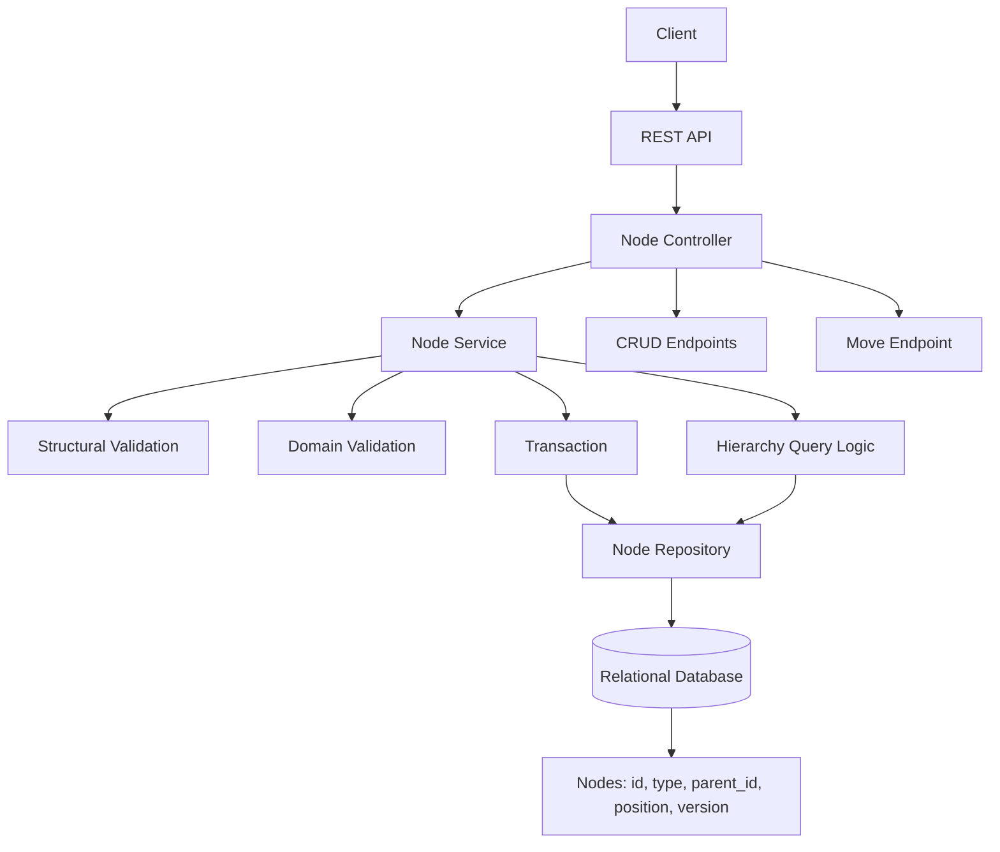
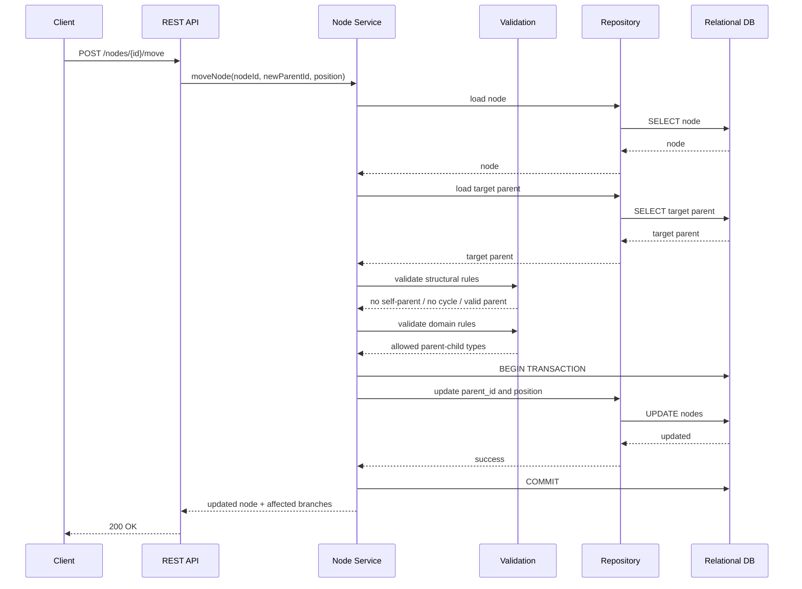

# Architecture Challenge

## Overview

Design the architecture for a **web application that manages the asset tree** you built in the coding challenge. The application should let users visualize the tree and perform CRUD operations on its nodes (Locations, Assets, and Components) — including creating, editing, relocating, and deleting nodes.

Document your architecture in this file using **text-based diagrams** (Mermaid, ASCII, or any text-renderable format — no images).

---

## Functional Requirements

1. **Tree visualization** — display the full hierarchy of Locations, Assets, and Components as an interactive tree.
2. **Create node** — add a new Location, Asset, or Component under a selected parent node.
3. **Edit node** — update the properties of an existing node (name, sensor type, status, etc.).
4. **Relocate node** — move a node (and its subtree) to a different parent via drag-and-drop or explicit action.
5. **Delete node** — remove a node and its entire subtree, with a confirmation step.

---

## What You Must Deliver

Design and document the following **three layers** in the sections below. Use **Mermaid diagrams** (preferred) or ASCII diagrams — no images.

### 1. Frontend Architecture

Consider:
- Framework/library choices and why
- Component structure (tree view, forms, modals, etc.)
- State management — how the tree state is kept in sync after mutations
- How drag-and-drop relocation works
- Optimistic updates vs. waiting for server confirmation

```mermaid
%% Replace this block with your frontend architecture diagram
```

**Your explanation:**

<!-- Write your reasoning here -->

---

### 2. Backend Architecture

Consider:
- API design (REST, GraphQL, etc.) and endpoint/operation structure for each CRUD action
- How relocating a node is handled (cycle prevention, subtree integrity)
- Database choice and how the tree is stored (adjacency list, nested sets, materialized path, etc.)
- Validation rules (e.g., a Component can only be a child of an Asset or Location)

#### Backend Architecture Overview



**Your explanation:**

1. Decision drivers

The backend must provide a reliable model for hierarchical data with emphasis on correctness during structural mutations. The central operation is moving a node or subtree within the tree, which introduces constraints around atomicity, cycle prevention, parent validation, and concurrent modification handling. The persistence and API design should support the main read patterns efficiently, especially subtree retrieval, ancestor reconstruction, and partial refresh after a move. Because the solution is expected to be maintainable by a small team, the architecture should prioritize clear domain semantics, testable invariants, and moderate operational complexity rather than overly specialized optimizations.

2. Options considered

Several hierarchy persistence models were considered. An adjacency list stores only the direct parent reference and offers the simplest write model, especially for create and move operations, but requires recursive traversal for subtree and ancestor queries. Materialized path stores the ancestry path on each node, which simplifies subtree and path queries, but makes subtree moves more expensive because descendant paths must be rewritten. Nested sets support efficient read-heavy hierarchical queries, but are poorly suited for frequent structural mutations due to costly index recalculation. Closure table stores ancestor-descendant relationships explicitly and provides flexible hierarchy queries, but increases schema complexity, write complexity, and operational overhead. Given that subtree relocation is a central domain operation and maintainability is an important constraint, the strongest candidates are adjacency list and materialized path, with nested sets and closure table being less attractive for an initial implementation.

3. Recommended approach

The backend should be implemented as a REST API backed by a relational database, with the hierarchy stored using an adjacency list model. Each node is persisted with a `parent_id` reference to its direct parent, which keeps the data model simple and well aligned with the domain. Standard CRUD actions should be exposed through regular endpoints for creating, retrieving, updating, and deleting nodes, while hierarchy-specific reads such as children, subtree, and ancestors should be exposed through dedicated read endpoints. Node relocation should not be treated as a generic update; instead, it should be modeled as an explicit operation such as `POST /nodes/{id}/move`, since relocating a node requires specialized validation and transactional handling.

This approach directly addresses the challenge requirements. For API design, it provides a clear REST structure for CRUD actions and hierarchy operations. For relocation, it ensures that moving a node is validated and executed atomically, including prevention of cycles, rejection of self-parenting, validation of the target parent, and preservation of subtree integrity. For persistence, a relational database with adjacency list storage is recommended because it provides strong consistency and avoids the higher mutation complexity of models such as nested sets or materialized path. For validation, the backend enforces both structural rules and business rules, including constraints such as allowing a Component to exist only under an Asset or Location. Overall, this design offers the best balance of correctness, clarity, and maintainability.

#### Transactional Flow for Node Relocation



4. Tradeoffs

The recommended backend architecture prioritizes correctness, maintainability, and explicit domain behavior, but it does so by accepting some read-side complexity. Using a relational database with adjacency list storage keeps structural writes simple and makes operations such as node relocation easier to validate and execute safely inside a transaction. This is a strong fit because cycle prevention, subtree integrity, and domain-specific parent-child validation can all be enforced in a dedicated backend operation rather than hidden inside generic update logic. The API also becomes clearer, since standard CRUD actions remain simple while hierarchy-specific operations such as subtree retrieval and node movement are modeled explicitly.

The main tradeoff is that adjacency list is less efficient for certain hierarchical reads, especially subtree traversal and ancestor reconstruction, which require recursive queries or equivalent backend traversal logic. This means the architecture gives up some read performance and query convenience compared with models such as materialized path or closure table. It also places more responsibility on the application layer to enforce tree invariants and type-based validation rules. In addition, choosing REST over GraphQL favors operational clarity and explicit commands over flexible client-driven querying. These tradeoffs are acceptable because the primary requirement is safe, understandable handling of hierarchy mutations rather than maximum optimization for complex read patterns.

---

### 3. Infrastructure Architecture

Consider:
- How the application is deployed (cloud services, containers, serverless, etc.)
- CI/CD pipeline overview
- Observability: logging, metrics, alerting
- How the system scales if the tree grows to hundreds of thousands of nodes

```mermaid
%% Replace this block with your infrastructure architecture diagram
```

**Your explanation:**

<!-- Write your reasoning here -->

---

## Evaluation Criteria

This exercise is **manually reviewed**. There is no single correct answer. We are looking for:

| Criteria | What we look for |
|---|---|
| **Clarity** | Can we understand your architecture quickly? Are the diagrams readable? |
| **Reasoning** | Do you justify your choices? Trade-offs matter more than picking the "right" tool. |
| **Completeness** | Are all three layers addressed? Are the connections between them clear? |
| **Practicality** | Does this feel like something a small team could build and maintain? Over-engineering is a negative signal. |

## Tips

- **Trade-offs > buzzwords.** Explain *why* you chose something, not just *what*.
- **Keep it buildable.** Design something a team of 4-6 engineers could realistically ship.
- **Mermaid reference:** [mermaid.js.org](https://mermaid.js.org/) — GitHub renders Mermaid blocks natively in markdown files.
